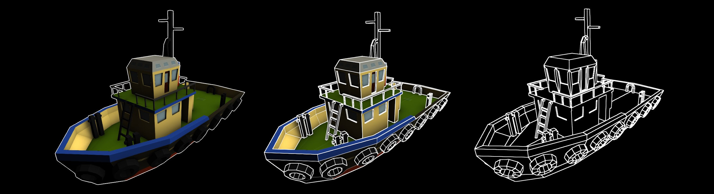

# How to render outlines in WebGL

This is the source code for [How to render outlines in WebGL](https://omar-shehata.medium.com/how-to-render-outlines-in-webgl-8253c14724f9) implemented in ThreeJS and PlayCanvas. This renders outlines with a post-process shader that takes the depth buffer and a surface normal buffer as inputs, followed by an FXAA pass. 

_Boat model by [Google Poly](https://poly.google.com/view/84-DYhLzxNq)_

* **Left** is a common way to visualize outlines, boundary only. 
* **Middle** is the technique in this repo. 
* **Right** is same as middle with outlines only.
### Live demo

See [ThreeJS version on CodeSandbox](https://l01dp.csb.app/). 

Drag and drop any glTF file to see the outlines on your own models (must be a single `.glb` file).

### Source code

* [ThreeJS version](threejs/README.md)
* [PlayCanvas version](playcanvas/README.md)
